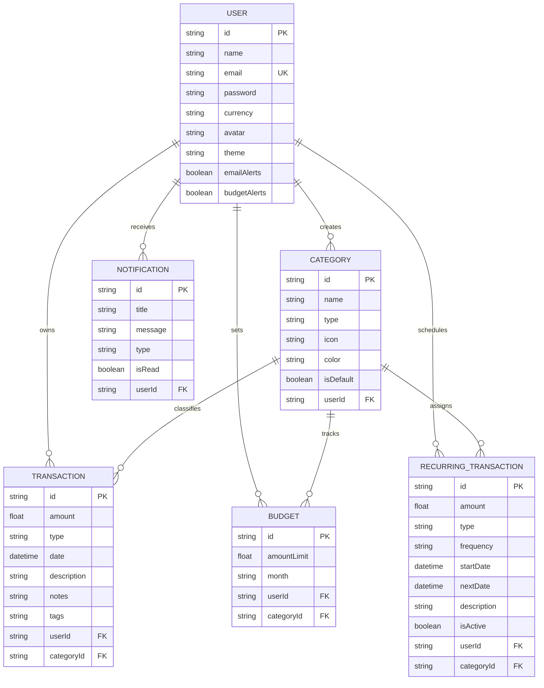

# PennyTrack — Personal Expense Tracker & Budget Management System

> **Full-Stack Portfolio Project** | Built with **Next.js 14 (App Router)**, **TypeScript**, **Tailwind CSS**, **Prisma ORM**, **PostgreSQL / SQLite**, and **Recharts**.

---

## 🌟 Executive Summary

**PennyTrack** is a modern, responsive personal finance web application designed to help individuals monitor their cash flow, manage category spending limits, automate recurring bills, and visualize financial habits through interactive analytics. 

Developed specifically as a comprehensive portfolio project demonstrating end-to-end full-stack web engineering, database architecture, responsive UI/UX, and data security.

---

## 🚀 Key Features

### 1. 📊 Bento-Grid Dashboard Overview
- **Real-Time Summary Metrics:** Total Income, Total Expenses, Net Surplus/Deficit Balance, and Savings Rate.
- **Monthly Budget Progress:** Visual threshold bars tracking category spending against allocated caps.
- **Interactive Visualizations:** Monthly cash flow comparisons (Income vs. Expense) and Spending by Category donut chart.
- **Recent Transactions Stream:** Latest financial activities with category badges, amounts, and dates.
- **Smart Spending Insights:** Automated descriptive observations (e.g., month-over-month changes, top expense drivers).

### 2. 💳 Income & Expense Tracking
- **Multi-Type Transactions:** Add, edit, and delete income and expense records.
- **Smart Categorization:** 18+ default income and expense categories with customizable icons and color coding.
- **Search, Filter & Sort:** Instant search across descriptions, notes, and tags; filter by type, category, or custom date ranges.
- **Bulk CSV Import & Export:** Download transaction records as CSV or bulk upload spreadsheet data.

### 3. 🎯 Budget Management & Alert Thresholds
- **Category-Specific Limits:** Assign monthly spending caps (e.g., Food & Dining ₱8,000, Housing ₱15,000).
- **Dynamic Warning Indicators:**
  - 🟢 **On Track:** < 80% utilization
  - 🟡 **Warning:** 80% – 99% utilization
  - 🔴 **Over Budget:** ≥ 100% limit exceeded
- **Multi-Month History:** Review previous budget cycles and evaluate budget discipline over time.

### 4. 📈 Financial Analytics & Downloadable Reports
- **Monthly Cash Flow Trends:** 6-month historical comparisons using Recharts.
- **Daily Spending Trajectory:** Area chart mapping expense velocity across the active month.
- **Category Share Breakdown:** Detailed table with spending percentages and transaction counts.
- **Budget Utilization Matrix:** Side-by-side comparison of allocated budgets vs. actual spending.
- **Professional PDF & CSV Statements:** Generate executive PDF financial statements with tables and performance metrics via `jspdf`.

### 5. 🔄 Recurring Transactions & Automated Reminders
- **Repeating Schedules:** Weekly, Monthly, and Yearly repeating templates (subscriptions, utilities, salary).
- **Status Controls:** Active and Paused state management.
- **Upcoming Due Reminders:** Visual indicator and in-app alerts for bills due within 5 days.
- **1-Click Execution:** Process due transactions automatically or manually trigger execution on demand.

### 6. ⚙️ User Preferences, Security & Data Ownership
- **Multi-Currency Support:** Philippine Peso (`₱` PHP), US Dollar (`$` USD), Euro (`€` EUR), British Pound (`£` GBP), Japanese Yen (`¥` JPY), CAD, AUD, SGD.
- **Color Theme Modes:** Clean Light, Midnight Dark, and System Auto mode.
- **Data Privacy & Full Export:** Download a complete machine-readable JSON backup of your account data.
- **Permanent Account Deletion:** Full database cascade erasure respecting user data ownership.
- **1-Click Demo Data Reset:** Pre-populates 40+ realistic Philippine Peso transactions, category budgets, and recurring subscriptions for instant evaluation.

---

## 🛠️ Technology Stack

| Layer | Technology |
| :--- | :--- |
| **Frontend Framework** | [Next.js 14](https://nextjs.org/) (App Router, Server & Client Components, TypeScript) |
| **Styling & UI** | [Tailwind CSS](https://tailwindcss.com/), [Lucide React](https://lucide.dev/), [Sonner Toasts](https://sonner.emilkowal.ski/) |
| **Data Visualization** | [Recharts](https://recharts.org/) (Bar, Area, Pie & Donut Charts) |
| **Database & ORM** | [Prisma ORM](https://www.prisma.io/) with **SQLite** (local zero-config) / **PostgreSQL** (production) |
| **Authentication** | [Jose](https://github.com/panva/jose) (JWT Tokens) & [Bcryptjs](https://github.com/dcodeIO/bcrypt.js) (Password Hashing) |
| **Report Generation** | [jsPDF](https://github.com/parallax/jsPDF) & [jspdf-autotable](https://github.com/simonbengtsson/jsPDF-AutoTable) |

---

## 📂 Project Architecture

```
Finance/
├── prisma/
│   ├── schema.prisma       # Relational models: User, Category, Transaction, Budget, Recurring, Notification
│   └── seed.js             # Realistic Philippine Peso sample database seeder
├── src/
│   ├── app/
│   │   ├── (auth)/         # Sign In and Register pages
│   │   ├── api/            # REST API Route handlers with JWT auth & ownership validation
│   │   │   ├── auth/       # Login, register, me, logout
│   │   │   ├── transactions/# CRUD, CSV export, CSV import
│   │   │   ├── budgets/    # Monthly budget management & threshold aggregations
│   │   │   ├── categories/ # Category management
│   │   │   ├── recurring/  # Recurring schedules & batch processor
│   │   │   ├── analytics/  # Recharts analytics & smart insights
│   │   │   ├── notifications/# Real-time notification updates
│   │   │   ├── profile/    # Preferences, password update, JSON backup, account deletion
│   │   │   └── seed/       # 1-click sample data reset endpoint
│   │   ├── dashboard/      # Bento-grid dashboard page
│   │   ├── transactions/   # Full transaction history with search, filters & pagination
│   │   ├── budgets/        # Budget limits, progress bars & alert thresholds
│   │   ├── analytics/      # Deep analytics & PDF statement generation
│   │   ├── recurring/      # Scheduled transactions management
│   │   ├── settings/       # Profile, preferences, security, data export
│   │   ├── layout.tsx      # Root provider wrapper (Theme, Auth, Sonner)
│   │   └── page.tsx        # Portfolio showcase landing page
│   ├── components/
│   │   ├── ui/             # Reusable atomic UI (Button, Input, Select, Modal, Badge, ProgressBar, Card)
│   │   ├── layout/         # AppLayout, Sidebar, Header, MobileNav
│   │   ├── dashboard/      # SummaryCards, Charts, Budget Progress, Recent Transactions, Quick Entry Modal
│   │   ├── transactions/   # TransactionTable, FilterBar, TransactionModal, CSVImportModal
│   │   ├── budgets/        # BudgetCard, BudgetModal
│   │   ├── analytics/      # SpendingTrendsChart, BudgetUtilizationChart, ExportReportModal
│   │   ├── recurring/      # RecurringCard, RecurringModal
│   │   └── settings/       # Profile, Preferences, Security, DataManagement
│   └── lib/
│       ├── prisma.ts       # Prisma Client singleton
│       ├── auth.ts         # JWT sign/verify & bcrypt password hashing
│       ├── currencies.ts   # Currency formatting utilities (PHP, USD, EUR, etc.)
│       ├── types.ts        # TypeScript interfaces and schemas
│       └── utils.ts        # Formatting helpers & cn utility
├── tailwind.config.ts
├── tsconfig.json
├── package.json
└── README.md
```

---

## ⚡ Quick Start Guide

### 1. Clone & Install Dependencies
```bash
git clone <repository-url>
cd Finance
npm install
```

### 2. Initialize Database & Seed Demo Data
```bash
# Push schema to SQLite database (dev.db)
npx prisma db push

# Populate realistic Philippine Peso demo data
npm run db:seed
```

### 3. Launch Development Server
```bash
npm run dev
```

Open [http://localhost:3000](http://localhost:3000) in your browser.

---

## 🔑 Demo Account Credentials

For instant grading, portfolio reviews, or evaluation:

- **Email:** `demo@pennytrack.com`
- **Password:** `pennytrack123`
- *(Or click the **"1-Click Demo Account Sign In"** button on the landing or login page)*

---

## 🗄️ Database Schema Diagram



---

## 🔒 Security & Data Integrity

1. **Password Hashing:** Passwords hashed with `bcryptjs` (salt rounds = 10).
2. **Server-Side Authorization:** Every database query validates ownership against the authenticated JWT session (`userId === authUser.id`).
3. **Monetary Precision:** Standard 2-decimal floating point normalization to prevent rounding anomalies.
4. **Cascade Deletions:** Relational cascades ensure data hygiene upon category or account deletion.

---

## 📄 License
This project was designed and built as a Full-Stack Portfolio Application.
Licensed under the [MIT License](LICENSE).
